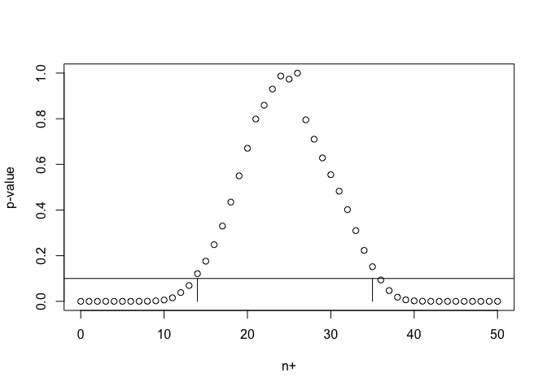

<!-- README.md is generated from README.Rmd. Please edit that file -->

# nplus

<!-- badges: start -->
<!-- badges: end -->

nplus is the package developed to provide confidence bounds on the
number of positive parameters on subsets of interest by using the
partitioning principle. Details may be found in Heller and Solari (2023)
\<arXiv:2301.01653\>.

# Installation

The latest version of the package can be installed with:

``` r
devtools::install_github("aldosolari/nplus")
```

# Example

Generate
")
with

for

and

for
.
Let

denote the number of positive parameters in the vector
").
In our simulated data,
.

The right-sided
-values
for the null hypotheses

are computed as
"),
where

is the cdf of the standard normal distribution.

``` r
set.seed(123)
x <- rnorm(50, mean = c(rep(2, 25), rep(-2, 25)))
p <- pnorm(x, lower.tail = FALSE)
n <- length(p)
```

To get
")-confidence
lower and upper bounds for the number of positive parameters
:

``` r
library(nplus)
nplus_bound(p, alpha = 0.1)
#> $lo
#> [1] 14
#> 
#> $up
#> [1] 35
```

To get
-values
for the null hypotheses

for
:

``` r
res <- nplus_pvalue(p)
res
#>  [1] 2.021188e-14 2.915688e-12 3.073869e-10 1.902482e-08 4.794630e-07
#>  [6] 3.950739e-06 2.200764e-05 1.116684e-04 4.974741e-04 2.002367e-03
#> [11] 5.709003e-03 1.543082e-02 3.837075e-02 6.917452e-02 1.212053e-01
#> [16] 1.757155e-01 2.482393e-01 3.297027e-01 4.348771e-01 5.496902e-01
#> [21] 6.704640e-01 7.986769e-01 8.591563e-01 9.299771e-01 9.869359e-01
#> [26] 9.733693e-01 1.000000e+00 7.951683e-01 7.102403e-01 6.282977e-01
#> [31] 5.547233e-01 4.824313e-01 4.017362e-01 3.096198e-01 2.231691e-01
#> [36] 1.515984e-01 9.354081e-02 4.701387e-02 1.812525e-02 6.595256e-03
#> [41] 1.977698e-03 5.074691e-04 1.246477e-04 2.658206e-05 5.346949e-06
#> [46] 9.457918e-07 1.074061e-07 4.777329e-09 1.932899e-10 5.474822e-12
#> [51] 4.799139e-14
```

Plot of the
-value
function:

``` r
plot(0:n, res, xlab="n+", ylab="p-value")
alpha = 0.1
abline(h = alpha)
segments(x0=min(which(res>alpha))-1, x1=min(which(res>alpha))-1, y0=0, y1=alpha)
segments(x0=max(which(res>alpha))-1, x1=max(which(res>alpha))-1, y0=0, y1=alpha)
```



To get lower and upper bounds for

from the
-values:

``` r
range(which(res > alpha)) - 1
#> [1] 14 35
```

Index set of identified positive parameters
(i.e. )
and negative parameters
()
with familywise error rate control at level
:

``` r
nplus_fwer(p, alpha = 0.1)
#> $positive
#> [1]  3  6 16
#> 
#> $negative
#> [1] 26
```

For any subset
,
let
")
denote the number of positive parameters in the vector
 = (\theta_i, i\in \mathcal{I})").
In our simulated data,
 = 25")
for
.

To get
-values
for the null hypotheses
=v")
for
:

``` r
I = 1:25
resI <- nplus_pvalue(p, ix = I)
# lower and upper bound for n+(I)
range(which(resI > alpha)) - 1
#> [1] 14 25
```

# References

Heller, R., & Solari, A. (2023). Simultaneous directional inference.
arXiv preprint arXiv:2301.01653.

# Did you find some bugs?

Please write to <solari.aldo@gmail.com>.
